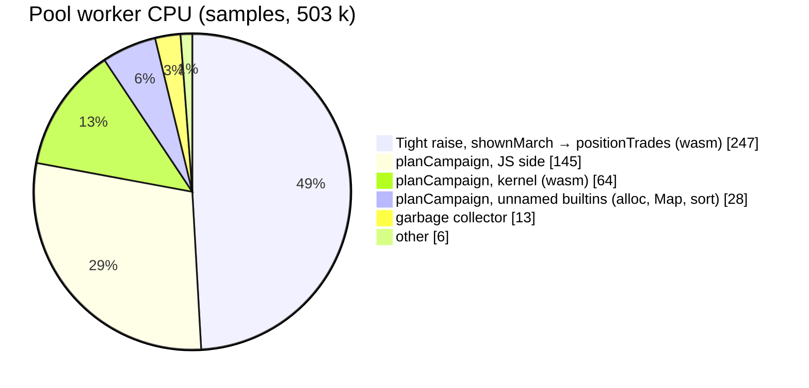

# The profile drill-down: where "Profile everything" spends its 23 s (W18)

**Status: proposed 2026-10-10.** Owner, 2026-10-10: *"I've done a trace using perfetto for the profile everything
task, plan a full optimization drill down using this trace as a base"* — `chrome-202696-18048.pftrace.gz`
(100 MB, 28.4 s, the owner's real account, `pnpm dev:profile`: dev React, kernel built with function names).

**The rule is W16's: nothing moves but the clock** (`docs/plans/refactor-speed.md` §2). Every step leaves every
plan, stop, position row, advisor row and benchmark figure **byte-identical**; a step that changes a reading is a
trade and goes to the owner. Steps marked **trade** below are listed so the owner can decide on them, not to be
done by default.

## 0. What the trace says

Read with Perfetto's trace processor (SQL over the trace's slices and its 2.49 M V8 CPU samples, ~140 µs apart, on
every thread). Figures are from this one trace; §1 P0 makes them repeatable.

### 0.1 The phases

| phase | wall | pool jobs | worker CPU | workers busy |
|---|---:|---|---:|---:|
| generate | 956 ms | 1 plan (382 ms) + 4 positions (344 ms) | 0.73 s | 1 of 6 |
| upgrades-default | 7 021 ms | 1 baseline + 29 probes, 575–1 895 ms each | 35.7 s | 91 % |
| captains | 8 312 ms | 1 baseline + 7 screen + 29 probes | 38.5 s | 74 % |
| other | 6 860 ms | 1 baseline + 19 probes, 641–2 918 ms each | 31.3 s | 73 % |
| **total** | **23.1 s** | 80 probes | **106 s** | |

With 6 workers, 106 s of CPU is **17.7 s** of wall at best: **5.4 s (23 %) is scheduling**, the rest is compute.
A probe on this account costs 0.6–2.9 s (the seeded army of the first profiling run: ~96 ms), so the account
size, not the probe count, is what makes the run long.

### 0.2 Where a probe's CPU goes (all pool workers, idle removed)

**The Tight raise is half of everything (49 %).** `runProbe` prices every stop *as the March shows it*
(`shownMarch`, `src/worker/jobs.ts:126`): the probe's own stops (30 % of probe CPU) and the baseline's counts
re-priced under the probe (`readProbe`, 20 %). Inside it, the battle loop of the raise search:

| kernel function | share of the Tight raise | what it is |
|---|---:|---|
| `killOrderBy` | 34.5 % | rebuild + insertion-sort of the stacks, every battle |
| `journalDamage` | 19.5 % | the journal, run twice (army first, not first) |
| `recoveryOf` | 16.3 % | the recovery bill, every battle |
| `attackOrderOf` | 12.8 % | the attack order, every battle |
| `raisePairwise` / `raiseRating` / `raisePointSlots` | 14.8 % | the search itself |

`raisePairwise` moves **two** slots per scored vector, yet `killOrderBy` rebuilds and re-sorts the whole roster
each time.

**`planCampaign` is the other half (48 %), and 60 % of it is still JS**: `evaluateVector` → `scorer` → `sizer`
→ `sizedShape` → `sizedCounts` → `sizeStacks`, `gridOnKernel`, `finish`/`finaleFor`, `retypeRow` (5 %),
`walkDown`/`sweep` (2 %). The unnamed frames (5.5 %) sit under `build`, `copyStacks`, `countsKey`,
`prefixFielded`: allocation and string keys. GC is 2.7 %; the long *Sweeping* / *Incremental Mark-Compact*
slices on the workers are concurrent spans, not CPU.

### 0.3 Where the wall clock is lost (the 5.4 s)

1. **A serial baseline at the head of every pass**: `runAdvisor` and `runCaptainAdvice` plan the baseline alone
   (`pool.map([baselineJob])`, `src/worker/advisor.ts:89`, `captainAdvice.ts:156`), 575–642 ms with five
   workers idle — three times, on what is likely the same baseline (same input, same settings).
2. **A barrier inside the captains pass**: the trio screen waits for the first probes to drain, then the
   upgrades pass starts its own fan-out (workers half idle from ~2.1 s to 3.3 s into the phase).
3. **Tails**: jobs are dispatched in probe order; with 0.6–2.9 s jobs, the last one decides the phase
   (`other`: a 2 918 ms probe started at 2.5 s).
4. **Generate runs its four positions jobs one after another on one worker** (all on one track, 419–766 ms),
   then ~190 ms of rendering.

### 0.4 The main thread

It is **100 % busy** for the whole run, but most of it is not the app's real cost:

- 33 % is `performance.measure` called by React's **dev-only** Performance Tracks (`logComponentRender`), and
  47.8 % is `(program)` that this trace cannot attribute (the `devtools.timeline` category was not recorded, so
  there is no layout, style or paint).
- What is real: **one full re-render per settled job**: `AdvisorCard` rendered 93 times, 28 600 Mantine `Box`
  renders, `StopList`, `PassSection`, `CaptainSection` re-rendering on every probe answer.
- It does not starve the pool: a worker's next job starts 2–8 ms after its last one ends.

So the page has to be measured again on a production build before anything on it is chosen (P0).

## 1. Steps

Each step: the measurement, the change, the gate (§2), one commit. Order is by measured gain over risk.
Estimates are marked as such; each step records its measured figure in §3 before the next starts.

### P0. Make the drill-down repeatable (no engine change)

- **P0.1** Commit the analysis as a tool, `tools/perf-trace/`: load a `.pftrace` with Perfetto's trace processor
  and print the four tables of §0 (phases, per-job, pool CPU tree split Tight / plan / wasm / JS, main-thread
  tree). Every later step quotes it before and after.
- **P0.2** A second trace on a **production** build (`VITE_PROFILING=1 pnpm build && pnpm preview`, so no dev
  React), with `devtools.timeline` on, to price the real main-thread cost.
- **P0.3** Counters in the profile build only: battles fought per probe, distinct vectors, memo hits, and
  whether the three baselines are byte-identical inputs (settles §0.3.1).
- **P0.4** A fixed fixture for the run: the owner's account export as a test profile (the 2026-10-07 export in the
  tree, if the owner agrees), so the before/after are the same account.

### P1. Scheduling: the 5.4 s of idle workers (est. −3 to −4 s wall, readings unchanged)

- **P1.1** **One baseline per run**: cache the baseline answer by its input key across the advisor, captains and
  other passes (if P0.3 shows they are identical). Saves two ~600 ms serial heads.
- **P1.2** **No serial head at all**: start the probes' `planCampaign` while the baseline is still running; a
  probe only needs the baseline for `readProbe`. Either two-step jobs (plan + own stops first, the read once the
  baseline lands) or the baseline sent to the workers as a message. The answer is the same; only the order of work
  moves.
- **P1.3** **Longest first**: dispatch probes by expected cost (last run's per-probe time, else the box size) to
  cut the tails. Results are already merged by probe, never by arrival (`advisor.ts` header), so the list cannot
  change.
- **P1.4** **No barrier in the captains pass**: let the trio screen and the upgrades fan-out share one queue.
- **P1.5** **Generate's positions in parallel** on the pool (four jobs, one track today).

### P2. The Tight raise: half the CPU

Corrected 2026-10-10 after reading the kernel (`kernel/assembly/index.ts`). The raise scores a vector with
`raiseScore` (kill order, attack order, **one** journal) and, under Tight's rating, `raiseRating` (the kill order
**again**, the recovery bill, the burn). A memo hit still calls `raiseRating`. Not every item in the first draft
was exact:

| item | exact? | why |
|---|---|---|
| P2.1 incremental kill order | yes, with care | ties (equal HP, equal rank) must keep row order; checked by a shadow sort on every vector |
| P2.2 fused journals | **not in the raise** | the raise runs one journal; the two-journal walk is the sizer's (plan side), census item K6 |
| P2.3 skip the recovery bill | **no, dropped** | the rating adds saved silver, gold and hired to the damage term, so a lower damage can rate higher |
| K2 one kill order per rated battle | yes | `raiseScore` and `raiseRating` sort the same vector twice on a memo miss |
| K1 memo the rated value | yes, if the census pays | the rating is fixed for one raise call; today a memo hit recomputes it |
| P2.4 Tight pricings across jobs (K3) | yes, if the census pays | pure in (request, counts); hits vary with job placement, answers do not |
| P2.5 warm start from the baseline | **no: trade** | the search may land elsewhere |

Two more places where speed itself can move an answer, both outside P2: the pool's 20 s pass clock (which probes are
cut depends on job order and speed, P1.3) and Generate's 8 s / 40 s clocks (only where they bind; none did here).

**No cache without a census** (owner, 2026-10-10): experiment 196 counts hits per stored entry and the projected
saving for K1 to K6 before any cache is built (rule in §5). Exact refactors (K2, P2.1) may come first.

The steps are the playbook `.maestro/playbooks/2026-10-10-Profile-Drilldown/` (DRILL-01 to DRILL-06).

### P3. `planCampaign`'s JS half (est. −10 to −20 % of pool CPU)

- **P3.1** Re-profile `planCampaign` on this account alone (W16 A1's method) — the W16 breakdown is from the
  benchmark armies, not this one.
- **P3.2** Port the `evaluateVector` → `scorer` → `sizer` → `sizedShape` → `sizedCounts` chain to the kernel
  (it calls `sizeStacks` on the kernel already; the JS around it is the cost), or batch it into one crossing.
- **P3.3** Allocation: numeric keys instead of `countsKey` strings, reused buffers in `build` / `copyStacks` /
  `prefixFielded`, no spread copies in hot loops.

### P4. The page (sized by P0.2 first)

- **P4.1** Progress renders at most once a frame (`requestAnimationFrame`-coalesced `onProgress`), the rows
  once a pass settles, not once a probe.
- **P4.2** Memoise the advisor rows (`AdvisorRowLine`, `StopList`, `MarchCost`) on their row identity so a new
  answer re-renders one row, not the card.
- **P4.3** Only if P0.2 shows style/layout cost: fewer Mantine `Box` wrappers in the rows.

### P5. Measure again

The same run on the same fixture, prod and dev traces, P0.1's tables side by side, the benchmark timing table, and
an entry in the performance log (`.maestro/playbooks/PERF_LOG_pyrrhic_*.md`).

## 2. The gate (every step)

W16's gate (`docs/plans/refactor-speed.md` §2), kernel only since E3: build, typecheck, lint, kernel tests,
goldens in `tests/golden/` byte-identical, `benchmark-latest.json` unchanged except timings, plus:

- the advisor rows of the P0.4 fixture byte-identical (every pass, every stop, every gain);
- P0.1's tables before and after, the step's own counter (battles, crossings, idle) quoted;
- a step that changes any reading stops and goes to the owner as a trade
  (the benchmark is non-regression: only the owner registers a new baseline, workers never re-base pins).

## 3. Progress

| step | before | after | commit |
|---|---|---|---|
| — | 23.1 s wall, 106 s pool CPU, 76 % pool efficiency | | |
| K2 one kill order per rated battle (Drill 02) | census: 1.76 % of the timing fixture's CPU, under the 2 % bar | not built (`WON'T DO`; re-open if a profiler-free browser run confirms the trace's Tight share) | 3ca36be |
| P2.1a kill-order shadow check (`KILL_CHECK` build only) | — | release wasm byte-identical; check passes on every scored vector of 184 + the exactness fixture's bar | 6385674 |
| P2.1 incremental kill order in the raise | 184 raise sum 129.7 s; 196 timing fixture Tight raise 11,621 ms (13.30 % of 87.4 s); `killOrderBy` self 5,008 ms (cpu-prof) | 110.7 s (−14.6 %); 10,867 ms (−6.5 %, 12.90 % of 84.2 s); `killOrderBy` 3,800 ms + `raiseMove` 586 ms. Every count, golden and `scored` unchanged | e2c03f5 |
| K6 sizer journals fused (Drill 02) | census: 0.13 % ceiling, under the 2 % bar | not built (`WON'T DO`) | 1ebb705 |
| P1.1 one baseline per run (K4, Drill 03) | census: 2.66 % / 1.39 % of run CPU, under the 3 % cache bar | not built (`WON'T DO`); its wall is P1.2's | a67ab26 |
| P1.2 probes start while the baseline plans | passes (6 workers, timing fixture, browser): upgrades 3,978 ms, other 3,308 ms | 3,841 ms, 3,124 ms (−140 to −180 ms a pass); answers identical, cut set only shrinks | af932e0 |
| P1.3 longest probes first | other pass 3,159 ms | 2,782 ms (−12 %); answers identical with no cut, but **the cut set changes at a binding clock**: a trade, on branch `w18-p13-longest-first` | branch a1a6393 |
| P1.4 captains: one queue | upgrade part 3,379 ms (mean of 3 A/B) | 3,375 ms (no gain); one more row cut at a 3 s clock: a trade, on branch `w18-p14-captains-one-queue`, recommended dropped | branch b93dfe8 |
| P1.5 Generate prices the bar in parallel | bar on the run's client 141 ms (timing fixture, 5 stops) | 100 ms on the advisor pool when idle; tables identical | fbb01c7 |
| K1 / K3 / K5 caches (Drill 04) | census rerun on 05ab2d6: K1 0.59 hits per entry, 2.21 %; K3 ≤ 0.56, ≤ 1.14 %; K5 22 / 8 per entry, ≤ 0.99 % | none built (`WON'T DO`, all under the 3 % bar; K1 and K3 also under 2 hits per entry) | c1d9b09 |

Drill 02 re-measure (2026-10-10, experiment 196 rerun on HEAD 1ebb705, profile kernel, one lane): every census count
identical to the committed report; exactness fixture 33.96 s → 33.45 s run CPU (raise 0.56 % of it, so noise),
timing fixture 87.40 s → 84.21 s (−3.6 %, of which the Tight raise −0.75 s). No new owner trace yet, so `analyse.py`
was not rerun; the trace figures in the first row still stand. Rerun report:
`.maestro/playbooks/Working/w18/d02-196-the-cache-census.md` (the committed census stays the record).

Drill 03 re-measure (2026-10-11, HEAD fbb01c7, P1.3 and P1.4 not merged). **Passes in the browser** (scratch
`.maestro/playbooks/Working/w18/passes.mjs`: real pool of 6 module workers, headless Chromium, timing fixture, no
clock, min of 3; this desktop runs the four passes in ~14 s, not the trace's 22 s): before the drill 13,911 ms (upgrades
3,978 · captains 4,998 · other 3,308), after 13,986 ms (3,885 · 5,182 · 3,182), answer hash unchanged
(`a9612b9ca0a9`). Run-to-run noise on this machine is ±300 ms per pass, so **no wall gain is measurable on main** here:
the serial heads P1.2 removes cost ~600 ms on the trace's slow profiled workers, about a third of that here, and
the rest of the idle time is the tail of the slowest probes (P1.3, a trade). **Experiment 196** (one lane, in-process,
so no scheduling change applies): every count identical; run CPU 33.45 → 29.45 s / 84.21 → 78.14 s, machine noise
(no work changed on one lane). **Experiment 190** (pool of `client.plan` jobs; untouched by this drill but for
`CalcPool.busy`): benchmark set N = 1 / 6 4,085 → 3,709 ms / 2,014 → 1,971 ms (×1.88), advisor shape 7,303 → 6,990 /
1,860 → 1,720 ms (×4.06), plans 19/19 identical at every N. Reruns: `Working/w18/d03-196-the-cache-census.md`,
`Working/w18/d03-190-the-pool.md` (the committed reports stay the record). A new owner trace is what would show
whether the trace's 23 % pool idle has moved.

Drill 04 re-measure (2026-10-11, HEAD 05ab2d6). No cache was committed, so there is no hit taken to set against a
projection. **Experiment 196** (one lane, in-process, profile kernel): every count identical to the Drill 03 rerun and
to the committed census; run CPU 29.45 → 33.15 s / 78.14 → 86.92 s, machine noise (no work changed). Tight raise
0.57 % / 12.84 % of the run, still far from the trace's 49.1 %, so K2 and K5's re-open condition is unmet. Rerun:
`.maestro/playbooks/Working/w18/d04-196-the-cache-census.md`.

## 4. Rough target

| | today | after P1 | after P1 + P2 + P3 (est.) |
|---|---:|---:|---:|
| pool CPU | 106 s | 106 s | ~55–70 s |
| pool efficiency | 76 % | ~90 % | ~90 % |
| wall, this account | 23.1 s | ~19.5 s | **~10–13 s** |

The estimates are arithmetic on §0's shares, not measurements; §3 replaces them step by step.

## 5. The census (experiment 196)

Report: `tools/theorycraft/out/196-the-cache-census.md` (2026-10-10). Same work as the profiling run, in-process,
one lane, no clock, profile kernel; two fixtures — **exactness** (owner export 2026-09-17, run CPU 34.0 s) and
**timing** (the 2026-10-07 account the owner profiled, not committed, run CPU 87.4 s).

**The rule** (owner, 2026-10-10: no cache without a census): **a cache is built only when it is hit on average at
least twice per stored entry and its projected saving is at least 3 % of the run's CPU on either fixture**; a
refactor (K2, K6) is done when it saves at least 2 %. Everything else is `WON'T DO` with its figures.

| candidate | kind | hits per entry (exactness / timing) | projected saving (exactness / timing) | verdict |
|---|---|---|---|---|
| K1 rated value memo | cache | 0.05 / 0.59 | 3 ms, 0.01 % / 1 934 ms, 2.21 % | **WON'T DO** — fails both bars |
| K2 one kill order per rated battle | refactor | 1 duplicate per rated miss | 32 ms, 0.09 % / 1 540 ms, 1.76 % | **WON'T DO** — under 2 % (see the caveat) |
| K3 `shownMarch` across jobs (exact key / kernel input key) | cache | 0.14 / 0.07 — 0.56 / 0.09 | 0.12 % / 0.97 % — 0.19 % / 1.20 % | **WON'T DO** — fails both bars |
| K4 one baseline across the three passes | cache | 2.00 / 2.00 | 903 ms, 2.66 % / 1 218 ms, 1.39 % | **WON'T DO** — hits pass, saving under 3 % |
| K5 Generate's bar ↔ advisor (exact key / kernel input key) | cache | 1.0 / 1.0 — 22 / 8 | 0.01 % / 0.00 % — 0.14 % / 1.05 % | **WON'T DO** — kernel key hits pass, saving under 3 % |
| K6 the sizer's two journals fused | refactor | — (5.55 M sizer kill orders, timing) | 0.13 % / 0.13 % (ceiling) | **WON'T DO** — under 2 % |

No cache and no census refactor passes. Consequences for the steps above:

- **P1.1 (one baseline per run) is dropped as a cache.** K4's inputs are byte-identical (2 repeats out of 3, both
  fixtures), but two baselines are 1.4–2.7 % of the CPU. Their cost is wall time — each is a serial head while the
  pool idles — so **P1.2** (no serial head) is the step that recovers it, without a cache.
- **P2's K1, K2, P2.4 (K3) are not built.** P2.1 (incremental kill order) is not a census item and stays open, to
  be sized by its own measurement.

**Caveat: the trace and the census disagree on the Tight raise.** In-process the Tight raise is 13.3 % of the
timing account's CPU (0.55 % on the exactness fixture); in the owner's trace it is 49.1 % of busy pool CPU — same
account, same 83 probes and 3 baselines. Every verdict above is on the in-process clock. If a browser run with no
profiler attached (P0.4 / the next drill) confirms the trace's share, K2 scales to about 49.1 % × 18.0 % (kill
order share of the Tight raise) × 0.63 (rated misses / ratings) ≈ **5.6 %** of pool CPU and passes its 2 % bar —
re-open K2 then. The same scaling (49.1 / 13.3 ≈ 3.7×) takes K5 on the kernel input key from 1.05 % to about
**3.9 %** with 8 hits per entry — it would pass, so re-open it too. K1 (0.59) and K3 (0.09 on the timing fixture)
fail on hits per entry whatever the clock; K4 and K6 are not raise time and do not scale.
