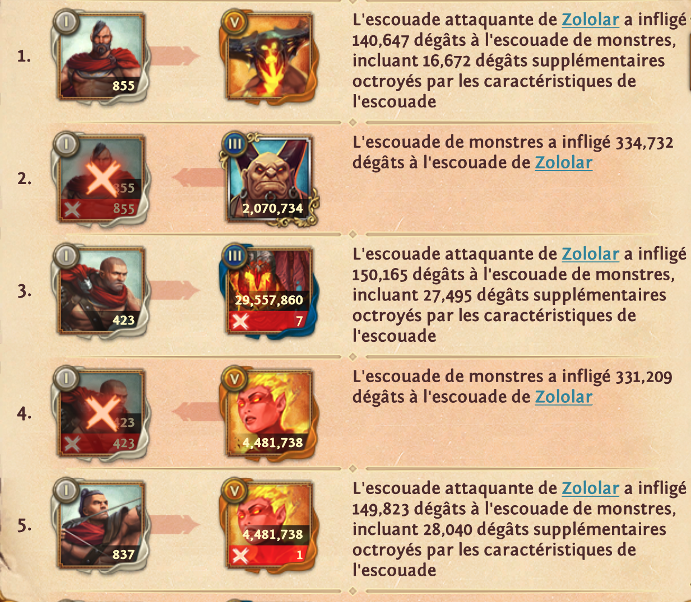
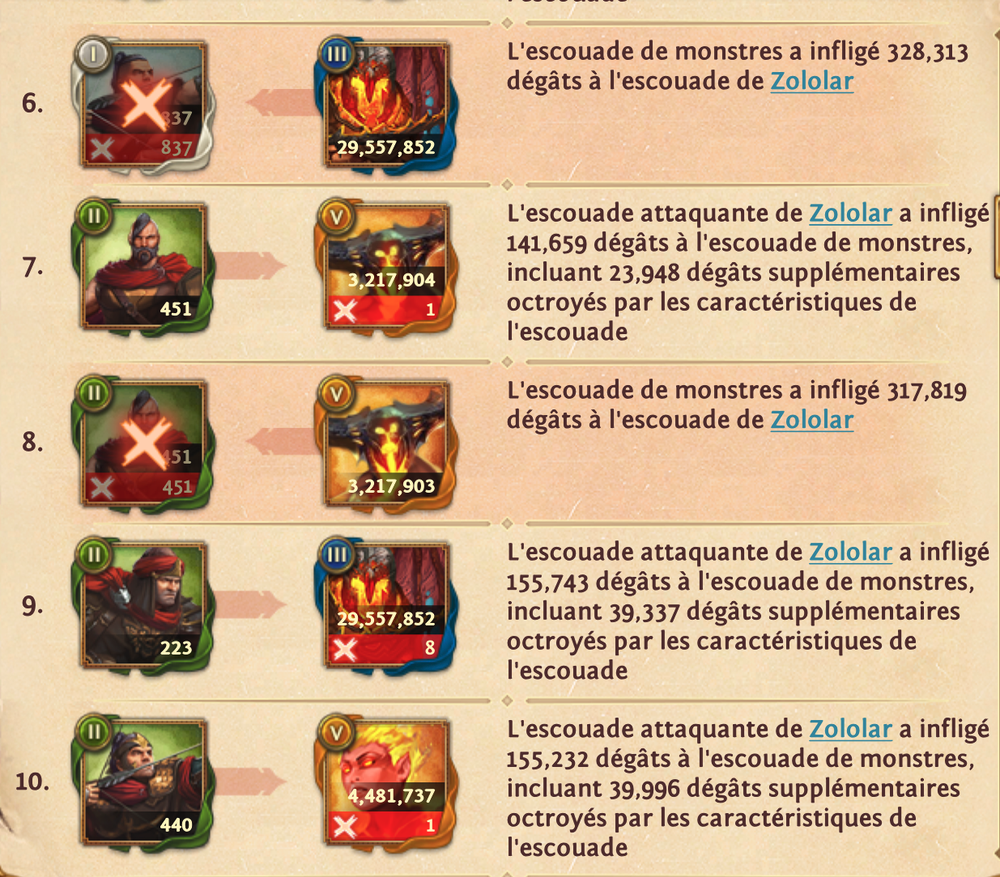
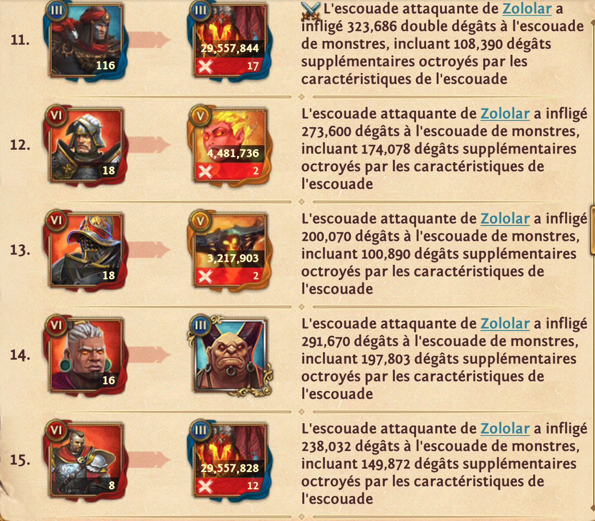
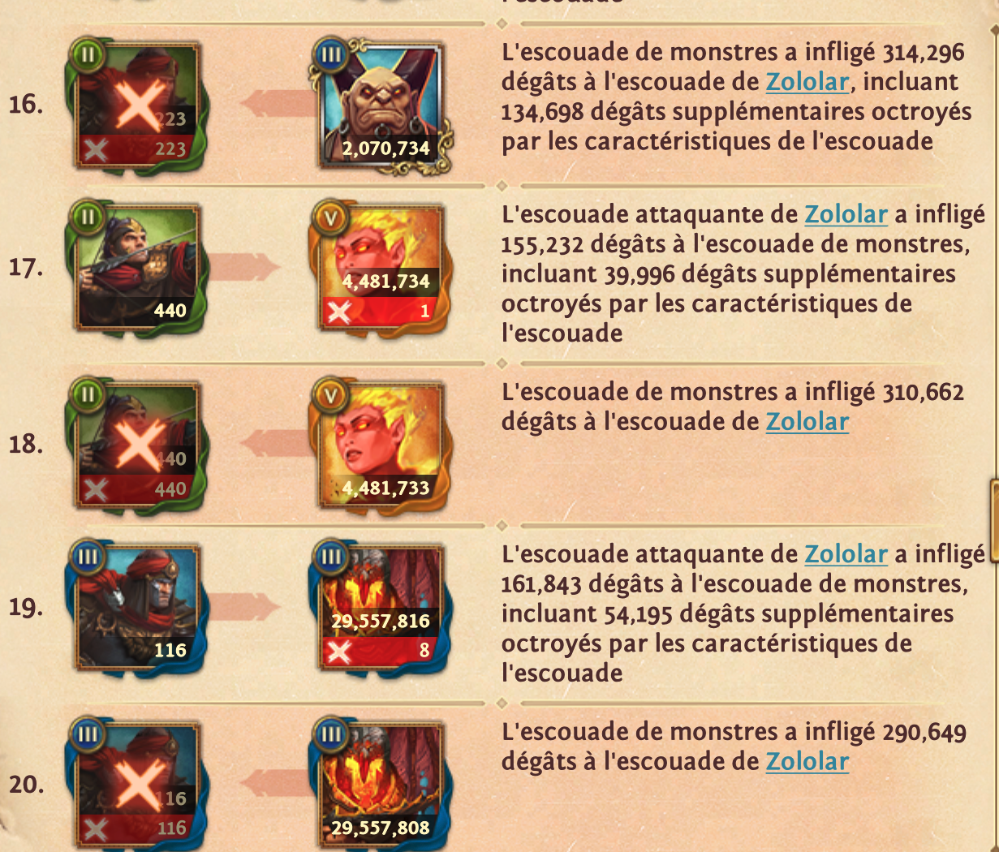
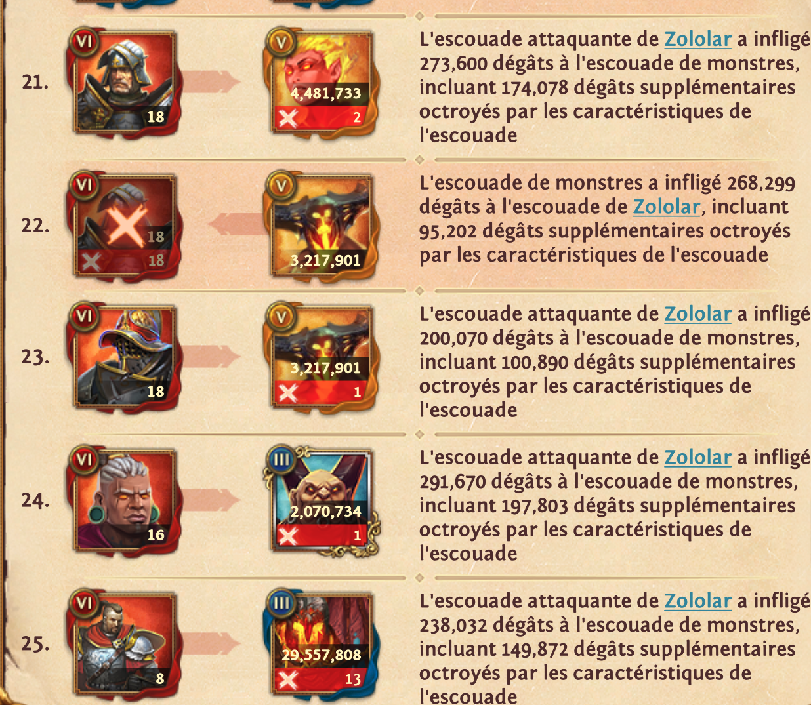
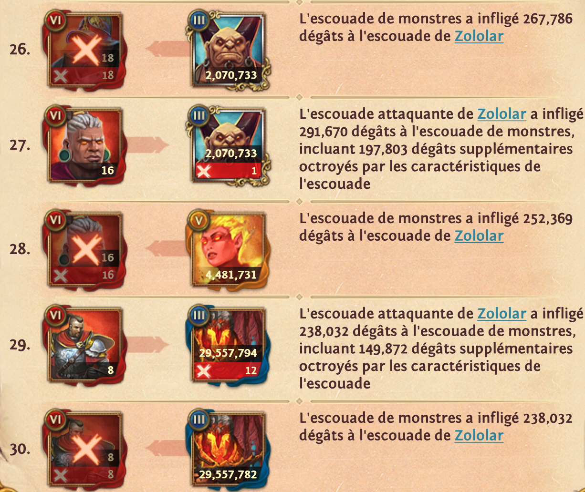

# Battle report — Zololar vs a monster's army

Full transcription of six screenshots of the in-game battle log (French UI), taken 2026-09-14.
The log scrolls continuously; the six screenshots cover entries **1–30** in order:

| Screenshot | Entries |
|---|---|
| `Screenshot_20260914_004404.png` | 1–5 |
| `Screenshot_20260914_004350.png` | 6–10 |
| `Screenshot_20260914_004336.png` | 11–15 |
| `Screenshot_20260914_004324.png` | 16–20 |
| `Screenshot_20260914_004303.png` | 21–25 |
| `Screenshot_20260914_004116.png` | 26–30 |

The name "kai" is not visible anywhere in the screenshots (they start mid-log, the report header is above
entry 1); the file name is the only trace of it.

## How to read an entry

Each entry is one exchange: a card, an arrow, another card, and one French sentence.

- **Left card** — the squad that struck, or the squad that was struck (matching the sentence).
- **Badge in the card's corner** — the troop tier in roman numerals: `I`, `II`, `III`, `VI` for Zololar's
  troops, `III` and `V` for the monster squads. The card frame is also tinted by tier (silver for I,
  green for II, blue for III, dark red for VI; gold, blue or orange for the monster squads).
- **White figure on a troop card** — the number of troops in that squad. It stays at the same value on
  every appearance until the squad is wiped; no partial losses are ever displayed in this log.
- **Red bar under a card** (`X` + number) — the losses of that squad in this single exchange. A squad is
  wiped when the red number equals the squad's figure; the card then gets the large red `X` overlay and
  shows its figure twice (white above, red below).
- **Big figure on a monster card** — the monster squad's remaining figure as displayed. It drops by
  exactly the number of kills in an exchange (three exceptions, see below). Entries 1 and 14 show a
  monster card with **no figure at all**.
- **"dégâts supplémentaires octroyés par les caractéristiques de l'escuade"** — extra damage granted by
  the squad's characteristics. It is a sub-portion *already included* in the total, never added to it.

Two sentence templates; "escuade" is the game's own spelling:

```
L'escuade attaquante de Zololar a infligé <D> dégâts à l'escuade de monstres,
incluant <E> dégâts supplémentaires octroyés par les caractéristiques de l'escuade

L'escuade de monstres a infligé <D> dégâts à l'escuade de Zololar
```

## The squads

The log shows portraits only — **no unit or monster names appear anywhere**, so squads are identified
here by tier badge and portrait.

### Zololar's squads (attacker) — 11 squads, 1,970 troops

| ID | Tier | Portrait | Troops | Damage per hit (incl. characteristics) | Struck at |
|---|---|---|---|---|---|
| A1 | I | bearded man, red cape over a bare chest | 855 | 140,647 (16,672) | 1 |
| A2 | I | bald man, red scarf, leather harness | 423 | 150,165 (27,495) | 3 |
| A3 | I | dark-haired man thrusting a spear, red tunic | 837 | 149,823 (28,040) | 5 |
| A4 | II | same art as A1, green II frame | 451 | 141,659 (23,948) | 7 |
| A5 | II | man in a red headband, dark armour | 223 | 155,743 (39,337) | 9 |
| A6 | II | archer drawing a bow, red sleeves | 440 | 155,232 (39,996) | 10, 17 |
| A7 | III | man in a red-plumed helmet | 116 | 161,843 (54,195) · **323,686 (108,390) on the doubled hit** | 11, 19 |
| A8 | VI | knight in a silver helmet, dark plate with a cross | 18 | 273,600 (174,078) | 12, 21 |
| A9 | VI | officer in a plumed gold-brimmed hat hiding the face | 18 | 200,070 (100,890) | 13, 23 |
| A10 | VI | white-haired man, green earrings, orange eyes, magenta robe | 16 | 291,670 (197,803) | 14, 24, 27 |
| A11 | VI | knight with a sword on the shoulder, red cape, silver pauldron | 8 | 238,032 (149,872) | 15, 25, 29 |

Every one of them is eventually wiped: A1 at 2, A2 at 4, A3 at 6, A4 at 8, A5 at 16, A6 at 18, A7 at 20,
A8 at 22, A9 at 26, A10 at 28, A11 at 30.

### Monster squads (defender) — 4 squads

| ID | Tier | Portrait | Figure at first sight | Figure at last sight | Kills taken | Hits landed | Damage landed (incl. characteristics) |
|---|---|---|---|---|---|---|---|
| M1 | V | blonde fire-elemental woman, glowing eyes, gold frame | 4,481,738 (E4) | 4,481,731 (E28) | 7 | 4, 18, 28 | 331,209 · 310,662 · 252,369 |
| M2 | V | dark winged demon with a fiery emblem on the chest | no figure (E1) / 3,217,904 (E7) | 3,217,901 (E23) | 4 | 8, 22 | 317,819 · 268,299 (95,202) |
| M3 | III | bald horned ogre with nose and ear rings, gold filigree frame | 2,070,734 (E2) | 2,070,733 (E27) | 2 | 2, 16, 26 | 334,732 · 314,296 (134,698) · 267,786 |
| M4 | III | molten fire giant, blue frame | 29,557,860 (E3) | 29,557,782 (E30) | 77 | 6, 20, 30 | 328,313 · 290,649 · 238,032 |

## The log

`Dmg` is the damage that entry's striker dealt; `extra` is the part of it granted by characteristics.
`Killed` is the red `X` badge on the struck squad's card.

| # | Striker | Squad struck with | Troops | Dmg | extra | Struck | Figure on its card | Killed |
|---|---|---|---|---|---|---|---|---|
| 1 | Zololar | A1 (I) | 855 | 140,647 | 16,672 | M2 (V) | *no figure shown* | — |
| 2 | monsters | M3 (III) | — | 334,732 | — | A1 (I) | — | 855 — A1 wiped |
| 3 | Zololar | A2 (I) | 423 | 150,165 | 27,495 | M4 (III) | 29,557,860 | 7 |
| 4 | monsters | M1 (V) | — | 331,209 | — | A2 (I) | — | 423 — A2 wiped |
| 5 | Zololar | A3 (I) | 837 | 149,823 | 28,040 | M1 (V) | 4,481,738 | 1 |
| 6 | monsters | M4 (III) | — | 328,313 | — | A3 (I) | — | 837 — A3 wiped |
| 7 | Zololar | A4 (II) | 451 | 141,659 | 23,948 | M2 (V) | 3,217,904 | 1 |
| 8 | monsters | M2 (V) | — | 317,819 | — | A4 (II) | — | 451 — A4 wiped |
| 9 | Zololar | A5 (II) | 223 | 155,743 | 39,337 | M4 (III) | 29,557,852 | 8 |
| 10 | Zololar | A6 (II) | 440 | 155,232 | 39,996 | M1 (V) | 4,481,737 | 1 |
| 11 | Zololar | A7 (III) | 116 | **323,686 (double)** | 108,390 | M4 (III) | 29,557,844 | 17 |
| 12 | Zololar | A8 (VI) | 18 | 273,600 | 174,078 | M1 (V) | 4,481,736 | 2 |
| 13 | Zololar | A9 (VI) | 18 | 200,070 | 100,890 | M2 (V) | 3,217,903 | 2 |
| 14 | Zololar | A10 (VI) | 16 | 291,670 | 197,803 | M3 (III) | *no figure shown* | — |
| 15 | Zololar | A11 (VI) | 8 | 238,032 | 149,872 | M4 (III) | 29,557,828 | 12 |
| 16 | monsters | M3 (III) | — | 314,296 | 134,698 | A5 (II) | — | 223 — A5 wiped |
| 17 | Zololar | A6 (II) | 440 | 155,232 | 39,996 | M1 (V) | 4,481,734 | 1 |
| 18 | monsters | M1 (V) | — | 310,662 | — | A6 (II) | — | 440 — A6 wiped |
| 19 | Zololar | A7 (III) | 116 | 161,843 | 54,195 | M4 (III) | 29,557,816 | 8 |
| 20 | monsters | M4 (III) | — | 290,649 | — | A7 (III) | — | 116 — A7 wiped |
| 21 | Zololar | A8 (VI) | 18 | 273,600 | 174,078 | M1 (V) | 4,481,733 | 2 |
| 22 | monsters | M2 (V) | — | 268,299 | 95,202 | A8 (VI) | — | 18 — A8 wiped |
| 23 | Zololar | A9 (VI) | 18 | 200,070 | 100,890 | M2 (V) | 3,217,901 | 1 |
| 24 | Zololar | A10 (VI) | 16 | 291,670 | 197,803 | M3 (III) | 2,070,734 | 1 |
| 25 | Zololar | A11 (VI) | 8 | 238,032 | 149,872 | M4 (III) | 29,557,808 | 13 |
| 26 | monsters | M3 (III) | — | 267,786 | — | A9 (VI) | — | 18 — A9 wiped |
| 27 | Zololar | A10 (VI) | 16 | 291,670 | 197,803 | M3 (III) | 2,070,733 | 1 |
| 28 | monsters | M1 (V) | — | 252,369 | — | A10 (VI) | — | 16 — A10 wiped |
| 29 | Zololar | A11 (VI) | 8 | 238,032 | 149,872 | M4 (III) | 29,557,794 | 12 |
| 30 | monsters | M4 (III) | — | 238,032 | — | A11 (VI) | — | 8 — A11 wiped |

No kill badge is ever shown on a monster card for an exchange where the monsters were the striker
(entries 2, 4, 6, 8, 16, 18, 20, 22, 26, 28, 30) — monster losses only ever appear on Zololar's hits.

### Verbatim (French, as shown)

1. L'escuade attaquante de Zololar a infligé 140,647 dégâts à l'escuade de monstres, incluant 16,672 dégâts supplémentaires octroyés par les caractéristiques de l'escuade
2. L'escuade de monstres a infligé 334,732 dégâts à l'escuade de Zololar
3. L'escuade attaquante de Zololar a infligé 150,165 dégâts à l'escuade de monstres, incluant 27,495 dégâts supplémentaires octroyés par les caractéristiques de l'escuade
4. L'escuade de monstres a infligé 331,209 dégâts à l'escuade de Zololar
5. L'escuade attaquante de Zololar a infligé 149,823 dégâts à l'escuade de monstres, incluant 28,040 dégâts supplémentaires octroyés par les caractéristiques de l'escuade
6. L'escuade de monstres a infligé 328,313 dégâts à l'escuade de Zololar
7. L'escuade attaquante de Zololar a infligé 141,659 dégâts à l'escuade de monstres, incluant 23,948 dégâts supplémentaires octroyés par les caractéristiques de l'escuade
8. L'escuade de monstres a infligé 317,819 dégâts à l'escuade de Zololar
9. L'escuade attaquante de Zololar a infligé 155,743 dégâts à l'escuade de monstres, incluant 39,337 dégâts supplémentaires octroyés par les caractéristiques de l'escuade
10. L'escuade attaquante de Zololar a infligé 155,232 dégâts à l'escuade de monstres, incluant 39,996 dégâts supplémentaires octroyés par les caractéristiques de l'escuade
11. ⚔️ L'escuade attaquante de Zololar a infligé 323,686 double dégâts à l'escuade de monstres, incluant 108,390 dégâts supplémentaires octroyés par les caractéristiques de l'escuade
12. L'escuade attaquante de Zololar a infligé 273,600 dégâts à l'escuade de monstres, incluant 174,078 dégâts supplémentaires octroyés par les caractéristiques de l'escuade
13. L'escuade attaquante de Zololar a infligé 200,070 dégâts à l'escuade de monstres, incluant 100,890 dégâts supplémentaires octroyés par les caractéristiques de l'escuade
14. L'escuade attaquante de Zololar a infligé 291,670 dégâts à l'escuade de monstres, incluant 197,803 dégâts supplémentaires octroyés par les caractéristiques de l'escuade
15. L'escuade attaquante de Zololar a infligé 238,032 dégâts à l'escuade de monstres, incluant 149,872 dégâts supplémentaires octroyés par les caractéristiques de l'escuade
16. L'escuade de monstres a infligé 314,296 dégâts à l'escuade de Zololar, incluant 134,698 dégâts supplémentaires octroyés par les caractéristiques de l'escuade
17. L'escuade attaquante de Zololar a infligé 155,232 dégâts à l'escuade de monstres, incluant 39,996 dégâts supplémentaires octroyés par les caractéristiques de l'escuade
18. L'escuade de monstres a infligé 310,662 dégâts à l'escuade de Zololar
19. L'escuade attaquante de Zololar a infligé 161,843 dégâts à l'escuade de monstres, incluant 54,195 dégâts supplémentaires octroyés par les caractéristiques de l'escuade
20. L'escuade de monstres a infligé 290,649 dégâts à l'escuade de Zololar
21. L'escuade attaquante de Zololar a infligé 273,600 dégâts à l'escuade de monstres, incluant 174,078 dégâts supplémentaires octroyés par les caractéristiques de l'escuade
22. L'escuade de monstres a infligé 268,299 dégâts à l'escuade de Zololar, incluant 95,202 dégâts supplémentaires octroyés par les caractéristiques de l'escuade
23. L'escuade attaquante de Zololar a infligé 200,070 dégâts à l'escuade de monstres, incluant 100,890 dégâts supplémentaires octroyés par les caractéristiques de l'escuade
24. L'escuade attaquante de Zololar a infligé 291,670 dégâts à l'escuade de monstres, incluant 197,803 dégâts supplémentaires octroyés par les caractéristiques de l'escuade
25. L'escuade attaquante de Zololar a infligé 238,032 dégâts à l'escuade de monstres, incluant 149,872 dégâts supplémentaires octroyés par les caractéristiques de l'escuade
26. L'escuade de monstres a infligé 267,786 dégâts à l'escuade de Zololar
27. L'escuade attaquante de Zololar a infligé 291,670 dégâts à l'escuade de monstres, incluant 197,803 dégâts supplémentaires octroyés par les caractéristiques de l'escuade
28. L'escuade de monstres a infligé 252,369 dégâts à l'escuade de Zololar
29. L'escuade attaquante de Zololar a infligé 238,032 dégâts à l'escuade de monstres, incluant 149,872 dégâts supplémentaires octroyés par les caractéristiques de l'escuade
30. L'escuade de monstres a infligé 238,032 dégâts à l'escuade de Zololar

## What the numbers say

**Damage is a function of the (striker, target) pair, not of the target's remaining figure.**
Every repeat of a pairing gives the exact same damage:

| Pairing | Entries | Damage |
|---|---|---|
| A8 (VI) → M1 | 12 (M1 at 4,481,736), 21 (M1 at 4,481,733) | 273,600 both times |
| A9 (VI) → M2 | 13 (M2 at 3,217,903), 23 (M2 at 3,217,901) | 200,070 both times |
| A10 (VI) → M3 | 14 (no figure), 24 (2,070,734), 27 (2,070,733) | 291,670 all three |
| A11 (VI) → M4 | 15 (29,557,828), 25 (29,557,808), 29 (29,557,794) | 238,032 all three |
| A6 (II) → M1 | 10, 17 | 155,232 both times |

**Entry 11 is a doubled hit.** The card carries a crossed-swords icon and the sentence reads
"323,686 **double** dégâts"; 323,686 = 2 × 161,843, the same squad's (A7) ordinary hit, and the
characteristics portion doubles with it (108,390 = 2 × 54,195).

**Every monster hit wiped its target outright.** No monster hit ever leaves a squad standing: damage
(238,032–334,732) always exceeds the squad's pool — e.g. 837 T1 troops at 150 hp = 125,550, or 8 T6
troops at 2,820 hp = 22,560.

**Monster damage to Zololar depends on the target squad, not only on the monster.**
M3 never lost a unit between entries 2 and 24 (figure 2,070,734 throughout) yet its damage fell:
334,732 → 314,296 → 267,786 against a T1 (855), a T2 (223) and a T6 (18). Same story for M1 and M4,
whose falls are confounded with their own shrinking figure and so can't separate the two effects.

**The monster's figure drops by exactly the kills shown** for M1, M2 and M3:

| Squad | Drops | Kills shown | Reconciles |
|---|---|---|---|
| M1 | 4,481,738 → 4,481,737 → 4,481,736 → 4,481,734 → 4,481,733 → 4,481,731 | 1, 1, 2, 1, 0, 2 | yes (−7 over 7 kills) |
| M2 | 3,217,904 → 3,217,903 → 3,217,901 | 1, 2 | yes (−3 over 3) |
| M3 | 2,070,734 → 2,070,733 | 1 | yes |

But M4, the fire giant, moves by one more or one fewer than the kills at three points:

| Segment | Figure | Kills | Δ | Expected |
|---|---|---|---|---|
| E3 → E6 | 29,557,860 → 29,557,852 | 7 | −8 | −7 |
| E9 → E11 | 29,557,852 → 29,557,844 | 8 | −8 | −8 ✓ |
| E11 → E15 | 29,557,844 → 29,557,828 | 17 | −16 | −17 |
| E15 → E19 | 29,557,828 → 29,557,816 | 12 | −12 | −12 ✓ |
| E19 → E20 | 29,557,816 → 29,557,808 | 8 | −8 | −8 ✓ |
| E25 → E29 | 29,557,808 → 29,557,794 | 13 | −14 | −13 |
| E29 → E30 | 29,557,794 → 29,557,782 | 12 | −12 | −12 ✓ |

Net: the figure falls 78 over 77 kills. Digits were re-read at pixel zoom, so this is what the screen
shows — either the badge misreports a kill in those three exchanges, or M4's figure is not a pure count.

**Kill totals:** M4 77, M1 7, M2 4, M3 2 — 90 kills over 19 Zololar hits; Zololar lost all 1,970 troops
in 11 monster hits.

**The characteristics portion is a stable per-squad share** of the damage, identical wherever a squad
(or monster) strikes: A8 174,078/273,600 (63.6 %), A10 197,803/291,670 (67.8 %), A9 100,890/200,070
(50.4 %), A11 149,872/238,032 (63.0 %), A6 39,996/155,232 (25.8 %), A7 54,195/161,843 (33.5 %),
M3 134,698/314,296 (42.9 %) at entry 16, M2 95,202/268,299 (35.5 %) at entry 22.

## Unresolved

- **No names.** Neither the troops nor the monsters are named in the log; identification rests on the
  tier badge and the portrait. `src/data/tables/monsters.json` holds tier III (Battle Boar, Emerald
  Dragon, Stone Gargoyle, Water Elemental) and tier V (Desert Vanquisher, Ettin, Fearsome Manticore,
  Flaming Centaur) monsters, but nothing in the screenshots confirms which — the ogre and the molten
  giant do not obviously match any of them.
- **Entries 1 and 14 show no figure** on the monster card while the sentence still reports damage.
  Every other monster card carries a figure, so this looks like a display state rather than a rule.
- **What the monster figure actually counts.** It drops by exactly the kill count, which reads as a
  unit count, but a unit count of 4.48 M (M1) to 29.56 M (M4) units is hard to square with ~19,000–21,000
  damage per kill on M4 (E11: 17 kills off 323,686 damage) and M4's ±1 drift.
- The report header (attacker stats, date, location, the "kai" in the file name) is above entry 1 and is
  not in any of the six screenshots.

## Sources

     
